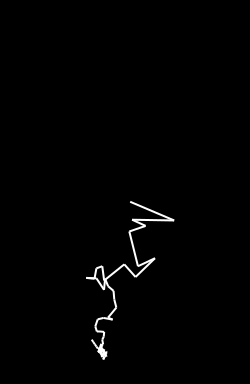

# fourier
Fourier series animations from svg paths with Julia.

When generating the svg files, the following must be true:
* Relative positions are enforced (no upper case markers)
* All segments of the path are bezier curves (no corners)
* The path to draw must be the only path in the file

This is easily accomplished in a program such as Inkscape.

